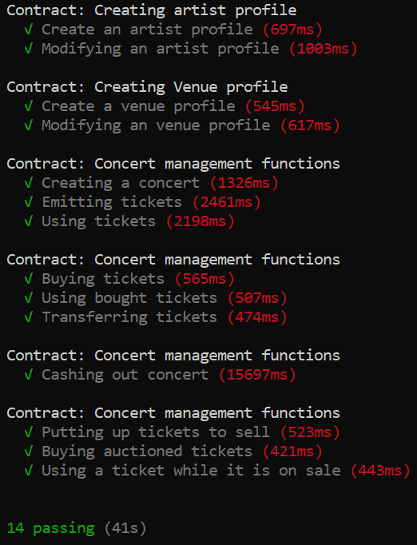

# Truffle-testing

## :memo: All Tasks:

:heavy_check_mark:Create a ticketing contract.   
:heavy_check_mark:Create function to create/modify an artist profile (Name, Artist type, Total tickets sold).  
:heavy_check_mark:Create functions to create/modify a venue profile (Name, Space available, % of ticket price going to venue with 2 decimals).  
:heavy_check_mark:Create a ticket object (concert ID, artist ID, venue ID).  
:heavy_check_mark:Create functions to create a concert, emit tickets and use tickets. Artists can emit tickets that they attribute to whoever they want.  
:heavy_check_mark:Ticket owner can use tickets on the day of the event.  
:heavy_check_mark:Create functions to buy and transfer tickets.  
:heavy_check_mark:Create a function for the artist to cash out after the concert. Make sure the concert has passed. Split the money between artist and venue.  
:heavy_check_mark:Create a function to safely trade ticket for money. Forbid selling the ticket for more than it was bought.  
 

